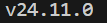

# VUE3_Vite_TS_PRACTISING

Repositorio para pruebas con el framework VUE 3, usando Vite para los test del proyecto y TS como lenguaje de programación principal.

## Requerimientos

Procedimiento completo aquí [Creating Vue Application](https://vuejs.org/guide/quick-start)

Necesitas tener la última versión de node.js. Aquí [Node.js](https://nodejs.org/es) puedes instalarla. Después abre una terminal en la raíz del proyecto y escribe:

```bash
node --version
```

Y como resultado tiene que salir por consola la versión de Node.js que hayas instalado:



Listo. Sólo queda descargar Visual Studio Code, añadir la extensión oficial de VUE y podemos comenzar.

## Comandos instalación e inicialización VUE

En la terminal abierta en la raíz de tu proyecto, escribe:

```bash
npm create vue@latest
```

Tras unos segundos te pedirá el nombre de tu proyecto, el nombre de tu carpeta de proyecto y unas opciones de configuración. Elije todas (Importante añadir TS, VUE ROUTER, PINIA, VITEST, EsLint y Prettier) menos End-to-End Testing Solution.

Después corre en orden estos comandos:

```bash
cd nombre_carpeta_proyecto
npm install
npm run format
```

Y ya tienes el entorno listo y configurado. Para ejecutarlo, debes usar este otro comando:

```bash
npm run dev
```

Ctrl + Click izquierdo encima de http://localhost:PUERTO abrirá una pestaña en tu navegador con la vista principal del proyecto.

### Configuración

Hay un problema que puede presentarse debido a que TypeScript no reconozca los archivos .vue debido al uso de Webpack. Aquí dejo dos sitios web donde explican el proceso [StackOverflow](https://stackoverflow.com/questions/54622621/what-does-the-shims-tsx-d-ts-file-do-in-a-vue-typescript-project) y [TypeScript for Webpack](https://fettblog.eu/typescript-modules-for-webpack/)

La solución implementada en este proyecto es crear un archivo en el src llamado **shims-vue.d.ts** cuyo contenido sea:

```bash
declare module '*.vue'
```
